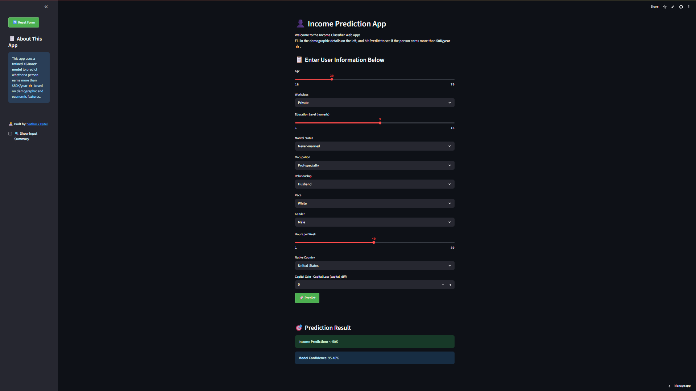

# 💼 Income Prediction Web App

A machine learning-powered web application that predicts whether a person earns more than \$50K per year based on demographic and economic features. Built with **Streamlit**, powered by **XGBoost**, and deployed on **Streamlit Cloud**.

---

## 📊 Project Overview

This project uses the [Adult Income Dataset](https://archive.ics.uci.edu/ml/datasets/adult) to build a classification model that determines income levels based on various factors like age, occupation, education, work hours, etc.

---

## 🖼️ App Screenshot



---

## 🚀 Live Demo

🔗 **Try the App:** [Click Here to Open](https://income-prediction-app-bivq7fi4jjlwd9iau6tcz4.streamlit.app/)

---

## 🛠️ Features

- Predicts whether an individual earns >\$50K or <=\$50K
- Clean and interactive **user interface** built with Streamlit
- **Reset button** to clear form inputs
- Model **confidence score** displayed with each prediction
- Sidebar with app info and GitHub profile link
- Custom CSS for better styling

---

## 📁 Repository Structure

```

├── app.py                   # Main Streamlit app
├── income\_xgb\_model.pkl     # Trained XGBoost model
├── requirements.txt         # Python dependencies
├── README.md                # Project documentation (this file)

````

---

## 🧠 Model Info

* **Algorithm**: XGBoost Classifier
* **Data Source**: UCI Adult Income Dataset
* **Target Variable**: `income` (binary classification)
* **Preprocessing**:

  * Cleaned missing/duplicate data
  * Encoded categorical variables
  * Feature engineering (capital\_diff)
  * Scaled numeric values using pipelines

---

## 📌 Technologies Used

* Python 🐍
* Streamlit 🖥️
* XGBoost 🌲
* Scikit-learn ⚙️
* Pandas & NumPy
* Google Colab (for training and EDA)
* Streamlit Cloud (for deployment)

---

## ✍️ Author

**Sathwik Patel**
🔗 [GitHub](https://github.com/SathwikPatel12)

---

## 🙌 Acknowledgments

* [UCI Machine Learning Repository](https://archive.ics.uci.edu/ml/datasets/adult)
* [Streamlit Docs](https://docs.streamlit.io)

